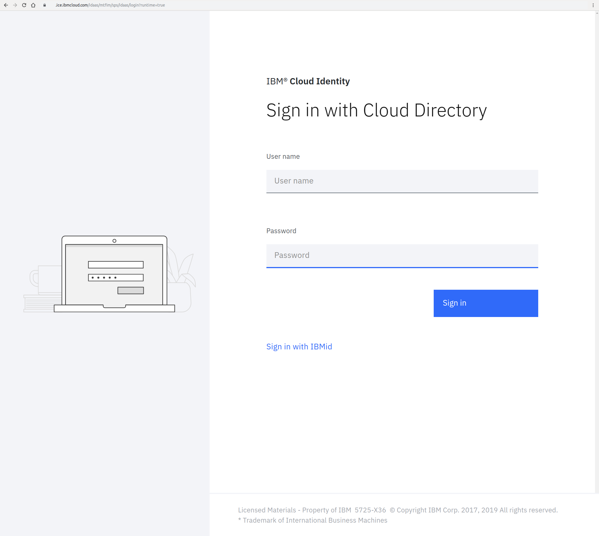

# CSS Urls
# - link rel='stylesheet' href='https://<yourtenant>.ice.ibmcloud.com/idaas/mtfim/static/styles.css'>
# - link rel='stylesheet' href='https://<yourtenant>.ice.ibmcloud.com/usc/css/stateless.css'>

## Useage:

# Directory actions
    # Directory actions_user_denied
        ## Directory default
            ### Directory default
                File actions_user_denied.html
        File metadata.json

    # Directory actions_user_mfa
        ## Directory default
            ### Directory default
                File actions_user_mfa.html
        File metadata.json

# Directory authbroker
    # Directory access_denied
        ## Directory default
            ### Directory default
                File page.html
        File metadata.json
    # Directory allerror
        ## Directory default
            ### Directory default
                File page.html
        File metadata.json
    # Directory error
        ## Directory default
            ### Directory default
                File page.html
        File metadata.json
    # Directory login_error
        ## Directory default
            ### Directory default
                File page.html
        File metadata.json
    # Directory login_verified
        ## Directory default
            ### Directory default
                File page.html
        File metadata.json
    # Directory Login_verified
        ## Directory default
            ### Directory default
                File page.html
        File metadata.json
    # Directory logout_success
        ## Directory default
            ### Directory default
                File page.html
        File metadata.json
    # Directory missing_component
        ## Directory default
            ### Directory default
                File page.html
        File metadata.json
    # Directory need_authentication
        ## Directory default
            ### Directory default
                File page.html
        File metadata.json
    # Directory no_protocol_detected
        ## Directory default
            ### Directory default
                File page.html
        File metadata.json
    # Directory protocol_error
        ## Directory default
            ### Directory default
                File page.html
        File metadata.json

## Directory social_login
File metadata.json
### Directory default
#### Directory default
- [page.html](authbroker/social_login/default/default/page.html)

  

# Directory authsvc
    ## Directory api_login
        ### Directory default
            #### Directory default
                File page.html
        File metadata.json

    ## Directory basicldapuser_changepassword
        ### Directory default
            #### Directory default
                File page.html
        File metadata.json
    ## Directory basicldapuser_login
        ### Directory default
            #### Directory default
                File page.html
        File metadata.json
    ## Directory combinedmfa_selection
        ### Directory default
            #### Directory default
                File page.html
        File metadata.json
    ## Directory fido2_authenticate
        ### Directory default
            #### Directory default
                File page.html
        File metadata.json
    ## Directory ibmverify_authenticator_selection
        ### Directory default
            #### Directory default
                File page.html
        File metadata.json
    ## Directory ibmverify_error
        ### Directory default
            #### Directory default
                File page.html
        File metadata.json
    ## Directory ibmverify_login
        ### Directory default
            #### Directory default
                File page.html
        File metadata.json
    ## Directory kerberos_error
        ### Directory default
            #### Directory default
                File page.html
        File metadata.json
    ## Directory kerberos_redirect
        ### Directory default
            #### Directory cs
                File page.html
            #### Directory de
                File page.html
            #### Directory default
                File page.html
            # Directory es
                File page.html
            # Directory fr
                File page.html
            # Directory hu
                File page.html
            # Directory it
                File page.html
            # Directory ja
                File page.html
            # Directory ko
                File page.html
            # Directory pl
                File page.html
            # Directory pt_BR
                File page.html
            # Directory ru
                File page.html
            # Directory zh_CN
                File page.html
            # Directory zh_TW
                File page.html
        File metadata.json
    # Directory knowledgequestions_answers
        ## Directory default
            ### Directory default
                File answers.html
        File metadata.json
    # Directory maasandroid_error
        ## Directory default
            ### Directory default
                File page.html
        File metadata.json
    # Directory maasandroid_login
        ## Directory default
            # Directory cs
                File page.html
            # Directory de
                File page.html
            ### Directory default
                File page.html
            # Directory es
                File page.html
            # Directory fr
                File page.html
            # Directory hu
                File page.html
            # Directory it
                File page.html
            # Directory ja
                File page.html
            # Directory ko
                File page.html
            # Directory pl
                File page.html
            # Directory pt_BR
                File page.html
            # Directory ru
                File page.html
            # Directory zh_CN
                File page.html
            # Directory zh_TW
                File page.html
        File metadata.json
    # Directory macotp_delivery_selection
        ## Directory default
            ### Directory default
                File page.html
        File metadata.json
    # Directory macotp_login
        ## Directory default
            ### Directory default
                File page.html
        File metadata.json
    # Directory otp_change_pin
        ## Directory default
            ### Directory default
                File page.html
        File metadata.json
    
## Directory otp_delivery_email
### Directory default
            # Directory cs
                File page.xml
            # Directory de
                File page.xml
            ### Directory default
                File page.xml
            # Directory es
                File page.xml
            # Directory fr
                File page.xml
            # Directory hu
                File page.xml
            # Directory it
                File page.xml
            # Directory ja
                File page.xml
            # Directory ko
                File page.xml
            # Directory pl
                File page.xml
            # Directory pt_BR
                File page.xml
            # Directory ru
                File page.xml
            # Directory zh_CN
                File page.xml
            # Directory zh_TW
                File page.xml
        File metadata.json

  

    # Directory otp_delivery_selection
        ## Directory default
            ### Directory default
                File page.html
        File metadata.json
    # Directory otp_delivery_sms
        ## Directory default
            # Directory cs
                File page.xml
            # Directory de
                File page.xml
            ### Directory default
                File page.xml
            # Directory es
                File page.xml
            # Directory fr
                File page.xml
            # Directory hu
                File page.xml
            # Directory it
                File page.xml
            # Directory ja
                File page.xml
            # Directory ko
                File page.xml
            # Directory pl
                File page.xml
            # Directory pt_BR
                File page.xml
            # Directory ru
                File page.xml
            # Directory zh_CN
                File page.xml
            # Directory zh_TW
                File page.xml
        File metadata.json
    # Directory otp_errors_allerror
        ## Directory default
            ### Directory default
                File page.html
        File metadata.json
    # Directory otp_errors_could_not_validate
        ## Directory default
            ### Directory default
                File page.html
        File metadata.json
    # Directory otp_errors_generating_otp
        ## Directory default
            ### Directory default
                File page.html
        File metadata.json
    # Directory otp_errors_get_delivery_options
        ## Directory default
            ### Directory default
                File page.html
        File metadata.json
    # Directory otp_errors_otp_delivery
        ## Directory default
            ### Directory default
                File page.html
        File metadata.json
    # Directory otp_errors_sts_invoke_failed
        ## Directory default
            ### Directory default
                File page.html
        File metadata.json
    # Directory otp_login
        ## Directory default
            ### Directory default
                File page.html
        File metadata.json
    # Directory otp_next_otp
        ## Directory default
            ### Directory default
                File page.html
        File metadata.json
    # Directory postauth_error
        ## Directory default
            ### Directory default
                File page.html
        File metadata.json
    # Directory proper_errors_all_error
        ## Directory default
            ### Directory default
                File page.html
        File metadata.json
    # Directory proper_errors_need_authentication
        ## Directory default
            ### Directory default
                File page.html
        File metadata.json
    # Directory totp_error
        ## Directory default
            ### Directory default
                File page.html
        File metadata.json
    # Directory totp_login
        ## Directory default
            ### Directory default
                File page.html
        File metadata.json

# Directory certmgr
    # Directory email_certmgr_campaign_change_status_to_owner
        ## Directory default
            ### Directory default
                File email_certmgr_campaign_change_status_to_owner_body.html
                File email_certmgr_campaign_change_status_to_owner_subject.txt
        File metadata.json
    # Directory email_certmgr_campaignreminder_to_reviewers
        ## Directory default
            ### Directory default
                File email_certmgr_campaignreminder_to_reviewers_body.html
                File email_certmgr_campaignreminder_to_reviewers_subject.txt
        File metadata.json
    # Directory email_certmgr_newcampaign_to_reviewers
        ## Directory default
            ### Directory default
                File email_certmgr_newcampaign_to_reviewers_body.html
                File email_certmgr_newcampaign_to_reviewers_subject.txt
        File metadata.json
    # Directory email_certmgr_redirection_notification
        ## Directory default
            ### Directory default
                File email_certmgr_redirection_notification_body.html
                File email_certmgr_redirection_notification_subject.txt
        File metadata.json
# Directory common
    # Directory branding
        ## Directory default
            ### Directory default
                File footer.html
                File header.html
                File logo.png
                File logo.svg
                File theme.css
        File metadata.json
# Directory commonfim
    # Directory generic_access_denied
        ## Directory default
            ### Directory default
                File page.html
        File metadata.json
    # Directory generic_missing_component
        ## Directory default
            ### Directory default
                File page.html
        File metadata.json
    # Directory generic_need_authentication
        ## Directory default
            ### Directory default
                File page.html
        File metadata.json
    # Directory generic_noprotdet
        ## Directory default
            ### Directory default
                File page.html
        File metadata.json
    # Directory generic_proper_error
        ## Directory default
            ### Directory default
                File page.html
        File metadata.json
    # Directory generic_protocol_error
        ## Directory default
            ### Directory default
                File page.html
        File metadata.json
# Directory factors
    # Directory EmailNotification
        ## Directory default
            ### Directory default
                File email_password_recovery.xml
        File metadata.json
    # Directory OtpDelivery
        ## Directory default
            # Directory cs
                File otp_delivery_email.xml
            # Directory de
                File otp_delivery_email.xml
            ### Directory default
                File otp_delivery_email.xml
            # Directory es
                File otp_delivery_email.xml
            # Directory fr
                File otp_delivery_email.xml
            # Directory hu
                File otp_delivery_email.xml
            # Directory it
                File otp_delivery_email.xml
            # Directory ja
                File otp_delivery_email.xml
            # Directory ko
                File otp_delivery_email.xml
            # Directory pl
                File otp_delivery_email.xml
            # Directory pt_BR
                File otp_delivery_email.xml
            # Directory ru
                File otp_delivery_email.xml
            # Directory zh_CN
                File otp_delivery_email.xml
            # Directory zh_TW
                File otp_delivery_email.xml
        File metadata.json

# Directory oidc
    # Directory custom_labels
        ## Directory default
            # Directory cs
                File custom_labels.properties
            # Directory de
                File custom_labels.properties
            ### Directory default
                File custom_labels.properties
            # Directory es
                File custom_labels.properties
            # Directory fr
                File custom_labels.properties
            # Directory hu
                File custom_labels.properties
            # Directory it
                File custom_labels.properties
            # Directory ja
                File custom_labels.properties
            # Directory ko
                File custom_labels.properties
            # Directory pl
                File custom_labels.properties
            # Directory pt
                File custom_labels.properties
            # Directory pt_BR
                File custom_labels.properties
            # Directory ru
                File custom_labels.properties
            # Directory zh_CN
                File custom_labels.properties
            # Directory zh_TW
                File custom_labels.properties
        File metadata.json
    # Directory user_authorize_denied
        ## Directory default
            ### Directory default
                File user_authorize_denied.html
        File metadata.json
    # Directory user_authorize_error
        ## Directory default
            ### Directory default
                File user_authorize_error.html
        File metadata.json
    # Directory user_authorize_input
        ## Directory default
            ### Directory default
                File user_authorize_input.html
        File metadata.json
    # Directory user_authorize_permitted
        ## Directory default
            ### Directory default
                File user_authorize_permitted.html
        File metadata.json
    # Directory user_consent
        ## Directory default
            ### Directory default
                File user_consent.html
        File metadata.json
    # Directory user_error
        ## Directory default
            ### Directory default
                File user_error.html
        File metadata.json
    # Directory user_response
        ## Directory default
            ### Directory default
                File user_response.html
        File metadata.json

# Directory reqmgr
    # Directory email_approver_additional_justification_provided
        ## Directory default
            ### Directory default
                File email_approver_additional_justification_provided_body.html
                File email_approver_additional_justification_provided_subject.txt
        File metadata.json
    # Directory email_approver_new_application_requested
        ## Directory default
            ### Directory default
                File email_approver_new_application_requested_body.html
                File email_approver_new_application_requested_subject.txt
        File metadata.json
    # Directory email_approver_reminder
        ## Directory default
            ### Directory default
                File email_approver_reminder_body.html
                File email_approver_reminder_subject.txt
        File metadata.json
    # Directory email_requestee_application_approved
        ## Directory default
            ### Directory default
                File email_requestee_application_approved_body.html
                File email_requestee_application_approved_subject.txt
        File metadata.json
    # Directory email_requestee_application_rejected
        ## Directory default
            ### Directory default
                File email_requestee_application_rejected_body.html
                File email_requestee_application_rejected_subject.txt
        File metadata.json
    # Directory email_requestor_application_approved
        ## Directory default
            ### Directory default
                File email_requestor_application_approved_body.html
                File email_requestor_application_approved_subject.txt
        File metadata.json
    # Directory email_requestor_application_rejected
        ## Directory default
            ### Directory default
                File email_requestor_application_rejected_body.html
                File email_requestor_application_rejected_subject.txt
        File metadata.json
# Directory risk
    # Directory adaptive_access_snippets
        ## Directory default
            ### Directory default
                File adaptive_access_snippets.html
        File metadata.json
    # Directory snippet_error
        ## Directory default
            ### Directory default
                File snippet_error.html
        File metadata.json
    # Directory trusteer_snippets
        ## Directory default
            ### Directory default
                File trusteer_snippets.html
        File metadata.json
    # Directory trusteer_snippets_eu
        ## Directory default
            ### Directory default
                File trusteer_snippets_eu.html
        File metadata.json
    # Directory trusteer_snippets_us
        ## Directory default
            ### Directory default
                File trusteer_snippets_us.html
        File metadata.json

# Directory saml20
    # Directory access_policy_challenge_decision
        ## Directory default
            ### Directory default
                File page.html
        File metadata.json
    # Directory access_policy_deny_decision
        ## Directory default
            ### Directory default
                File page.html
        File metadata.json
    # Directory access_policy_server_error
        ## Directory default
            ### Directory default
                File page.html
        File metadata.json
    # Directory art_exchange_failed
        ## Directory default
            ### Directory default
                File page.html
        File metadata.json
    # Directory authn_failed
        ## Directory default
            ### Directory default
                File page.html
        File metadata.json
    # Directory consent_to_federate
        ## Directory default
            ### Directory default
                File page.html
        File metadata.json
    # Directory error_building_msg
        ## Directory default
            ### Directory default
                File page.html
        File metadata.json
    # Directory error_decrypting_msg
        ## Directory default
            ### Directory default
                File page.html
        File metadata.json
    # Directory error_missing_config_param
        ## Directory default
            ### Directory default
                File page.html
        File metadata.json
    # Directory error_parsing_art
        ## Directory default
            ### Directory default
                File page.html
        File metadata.json
    # Directory error_parsing_msg
        ## Directory default
            ### Directory default
                File page.html
        File metadata.json
    # Directory error_sending_msg
        ## Directory default
            ### Directory default
                File page.html
        File metadata.json
    # Directory error_validating_art
        ## Directory default
            ### Directory default
                File page.html
        File metadata.json
    # Directory error_validating_init_msg
        ## Directory default
            ### Directory default
                File page.html
        File metadata.json
    # Directory error_validating_msg
        ## Directory default
            ### Directory default
                File page.html
        File metadata.json
    # Directory error_validating_msg_signature
        ## Directory default
            ### Directory default
                File page.html
        File metadata.json
    # Directory invalid_art
        ## Directory default
            ### Directory default
                File page.html
        File metadata.json
    # Directory invalid_init_msg
        ## Directory default
            ### Directory default
                File page.html
        File metadata.json
    # Directory invalid_msg
        ## Directory default
            ### Directory default
                File page.html
        File metadata.json
    # Directory logout_failed
        ## Directory default
            ### Directory default
                File page.html
        File metadata.json
    # Directory nimgmt_terminate_failed
        ## Directory default
            ### Directory default
                File page.html
        File metadata.json
    # Directory nimgmt_update_failed
        ## Directory default
            ### Directory default
                File page.html
        File metadata.json
    # Directory saml_post_request
        ## Directory default
            ### Directory default
                File page.html
        File metadata.json
    # Directory saml_post_response
        ## Directory default
            ### Directory default
                File page.html
        File metadata.json
    # Directory saml_uri_binding_404
        ## Directory default
            ### Directory default
                File page.html
        File metadata.json

# Directory USC
    # Directory UserSelfCareEmails
        ## Directory default
            # Directory cs
                File email_username_recovery.xml
            # Directory de
                File email_username_recovery.xml
            ### Directory default
                File email_username_recovery.xml
            # Directory es
                File email_username_recovery.xml
            # Directory fr
                File email_username_recovery.xml
            # Directory hu
                File email_username_recovery.xml
            # Directory it
                File email_username_recovery.xml
            # Directory ja
                File email_username_recovery.xml
            # Directory ko
                File email_username_recovery.xml
            # Directory pl
                File email_username_recovery.xml
            # Directory pt_BR
                File email_username_recovery.xml
            # Directory ru
                File email_username_recovery.xml
            # Directory zh_CN
                File email_username_recovery.xml
            # Directory zh_TW
                File email_username_recovery.xml
        File metadata.json

# Directory USC_LEGACY
    # Directory UserSelfCareLegacyEmails
        ## Directory default
            ### Directory default
                File adopter.properties
                File email_forgotten_password.xml
                File email_invite_registration.xml
                File email_user_changed.xml
                File email_user_registration_complete.xml
                File email_user_registration_preverify.xml
                File email_user_registration.xml
                File email_verify_token.xml
        File metadata.json

# Directory USER_MGMT
    # Directory UserManagementEmails
        ## Directory default
            # Directory cs
                File email_add_tenant_admin.xml
                File email_delete_tenant_admin.xml
                File email_group_mgmt_addgroup.xml
                File email_group_mgmt_deletegroup.xml
                File email_group_mgmt_modify_addusers.xml
                File email_group_mgmt_modify_removeusers.xml
                File email_user_mgmt_adduser.xml
                File email_user_mgmt_change_pwd_not_show_password.xml
                File email_user_mgmt_change_pwd_show_password.xml
                File email_user_mgmt_deleteuser.xml
                File email_user_mgmt_modify_profile.xml
                File email_user_mgmt_reset_pwd.xml
            # Directory de
                File email_add_tenant_admin.xml
                File email_delete_tenant_admin.xml
                File email_group_mgmt_addgroup.xml
                File email_group_mgmt_deletegroup.xml
                File email_group_mgmt_modify_addusers.xml
                File email_group_mgmt_modify_removeusers.xml
                File email_user_mgmt_adduser.xml
                File email_user_mgmt_change_pwd_not_show_password.xml
                File email_user_mgmt_change_pwd_show_password.xml
                File email_user_mgmt_deleteuser.xml
                File email_user_mgmt_modify_profile.xml
                File email_user_mgmt_reset_pwd.xml
            ### Directory default
                File email_add_tenant_admin.xml
                File email_delete_tenant_admin.xml
                File email_group_mgmt_addgroup.xml
                File email_group_mgmt_deletegroup.xml
                File email_group_mgmt_modify_addusers.xml
                File email_group_mgmt_modify_removeusers.xml
                File email_user_mgmt_adduser.xml
                File email_user_mgmt_change_pwd_not_show_password.xml
                File email_user_mgmt_change_pwd_show_password.xml
                File email_user_mgmt_deleteuser.xml
                File email_user_mgmt_modify_profile.xml
                File email_user_mgmt_reset_pwd.xml
            # Directory es
                File email_add_tenant_admin.xml
                File email_delete_tenant_admin.xml
                File email_group_mgmt_addgroup.xml
                File email_group_mgmt_deletegroup.xml
                File email_group_mgmt_modify_addusers.xml
                File email_group_mgmt_modify_removeusers.xml
                File email_user_mgmt_adduser.xml
                File email_user_mgmt_change_pwd_not_show_password.xml
                File email_user_mgmt_change_pwd_show_password.xml
                File email_user_mgmt_deleteuser.xml
                File email_user_mgmt_modify_profile.xml
                File email_user_mgmt_reset_pwd.xml
            # Directory fr
                File email_add_tenant_admin.xml
                File email_delete_tenant_admin.xml
                File email_group_mgmt_addgroup.xml
                File email_group_mgmt_deletegroup.xml
                File email_group_mgmt_modify_addusers.xml
                File email_group_mgmt_modify_removeusers.xml
                File email_user_mgmt_adduser.xml
                File email_user_mgmt_change_pwd_not_show_password.xml
                File email_user_mgmt_change_pwd_show_password.xml
                File email_user_mgmt_deleteuser.xml
                File email_user_mgmt_modify_profile.xml
                File email_user_mgmt_reset_pwd.xml
            # Directory hu
                File email_add_tenant_admin.xml
                File email_delete_tenant_admin.xml
                File email_group_mgmt_addgroup.xml
                File email_group_mgmt_deletegroup.xml
                File email_group_mgmt_modify_addusers.xml
                File email_group_mgmt_modify_removeusers.xml
                File email_user_mgmt_adduser.xml
                File email_user_mgmt_change_pwd_not_show_password.xml
                File email_user_mgmt_change_pwd_show_password.xml
                File email_user_mgmt_deleteuser.xml
                File email_user_mgmt_modify_profile.xml
                File email_user_mgmt_reset_pwd.xml
            # Directory it
                File email_add_tenant_admin.xml
                File email_delete_tenant_admin.xml
                File email_group_mgmt_addgroup.xml
                File email_group_mgmt_deletegroup.xml
                File email_group_mgmt_modify_addusers.xml
                File email_group_mgmt_modify_removeusers.xml
                File email_user_mgmt_adduser.xml
                File email_user_mgmt_change_pwd_not_show_password.xml
                File email_user_mgmt_change_pwd_show_password.xml
                File email_user_mgmt_deleteuser.xml
                File email_user_mgmt_modify_profile.xml
                File email_user_mgmt_reset_pwd.xml
            # Directory ja
                File email_add_tenant_admin.xml
                File email_delete_tenant_admin.xml
                File email_group_mgmt_addgroup.xml
                File email_group_mgmt_deletegroup.xml
                File email_group_mgmt_modify_addusers.xml
                File email_group_mgmt_modify_removeusers.xml
                File email_user_mgmt_adduser.xml
                File email_user_mgmt_change_pwd_not_show_password.xml
                File email_user_mgmt_change_pwd_show_password.xml
                File email_user_mgmt_deleteuser.xml
                File email_user_mgmt_modify_profile.xml
                File email_user_mgmt_reset_pwd.xml
            # Directory ko
                File email_add_tenant_admin.xml
                File email_delete_tenant_admin.xml
                File email_group_mgmt_addgroup.xml
                File email_group_mgmt_deletegroup.xml
                File email_group_mgmt_modify_addusers.xml
                File email_group_mgmt_modify_removeusers.xml
                File email_user_mgmt_adduser.xml
                File email_user_mgmt_change_pwd_not_show_password.xml
                File email_user_mgmt_change_pwd_show_password.xml
                File email_user_mgmt_deleteuser.xml
                File email_user_mgmt_modify_profile.xml
                File email_user_mgmt_reset_pwd.xml
            # Directory pl
                File email_add_tenant_admin.xml
                File email_delete_tenant_admin.xml
                File email_group_mgmt_addgroup.xml
                File email_group_mgmt_deletegroup.xml
                File email_group_mgmt_modify_addusers.xml
                File email_group_mgmt_modify_removeusers.xml
                File email_user_mgmt_adduser.xml
                File email_user_mgmt_change_pwd_not_show_password.xml
                File email_user_mgmt_change_pwd_show_password.xml
                File email_user_mgmt_deleteuser.xml
                File email_user_mgmt_modify_profile.xml
                File email_user_mgmt_reset_pwd.xml
            # Directory pt_BR
                File email_add_tenant_admin.xml
                File email_delete_tenant_admin.xml
                File email_group_mgmt_addgroup.xml
                File email_group_mgmt_deletegroup.xml
                File email_group_mgmt_modify_addusers.xml
                File email_group_mgmt_modify_removeusers.xml
                File email_user_mgmt_adduser.xml
                File email_user_mgmt_change_pwd_not_show_password.xml
                File email_user_mgmt_change_pwd_show_password.xml
                File email_user_mgmt_deleteuser.xml
                File email_user_mgmt_modify_profile.xml
                File email_user_mgmt_reset_pwd.xml
            # Directory ru
                File email_add_tenant_admin.xml
                File email_delete_tenant_admin.xml
                File email_group_mgmt_addgroup.xml
                File email_group_mgmt_deletegroup.xml
                File email_group_mgmt_modify_addusers.xml
                File email_group_mgmt_modify_removeusers.xml
                File email_user_mgmt_adduser.xml
                File email_user_mgmt_change_pwd_not_show_password.xml
                File email_user_mgmt_change_pwd_show_password.xml
                File email_user_mgmt_deleteuser.xml
                File email_user_mgmt_modify_profile.xml
                File email_user_mgmt_reset_pwd.xml
            # Directory zh_CN
                File email_add_tenant_admin.xml
                File email_delete_tenant_admin.xml
                File email_group_mgmt_addgroup.xml
                File email_group_mgmt_deletegroup.xml
                File email_group_mgmt_modify_addusers.xml
                File email_group_mgmt_modify_removeusers.xml
                File email_user_mgmt_adduser.xml
                File email_user_mgmt_change_pwd_not_show_password.xml
                File email_user_mgmt_change_pwd_show_password.xml
                File email_user_mgmt_deleteuser.xml
                File email_user_mgmt_modify_profile.xml
                File email_user_mgmt_reset_pwd.xml
            # Directory zh_TW
                File email_add_tenant_admin.xml
                File email_delete_tenant_admin.xml
                File email_group_mgmt_addgroup.xml
                File email_group_mgmt_deletegroup.xml
                File email_group_mgmt_modify_addusers.xml
                File email_group_mgmt_modify_removeusers.xml
                File email_user_mgmt_adduser.xml
                File email_user_mgmt_change_pwd_not_show_password.xml
                File email_user_mgmt_change_pwd_show_password.xml
                File email_user_mgmt_deleteuser.xml
                File email_user_mgmt_modify_profile.xml
                File email_user_mgmt_reset_pwd.xml
        File metadata.json
