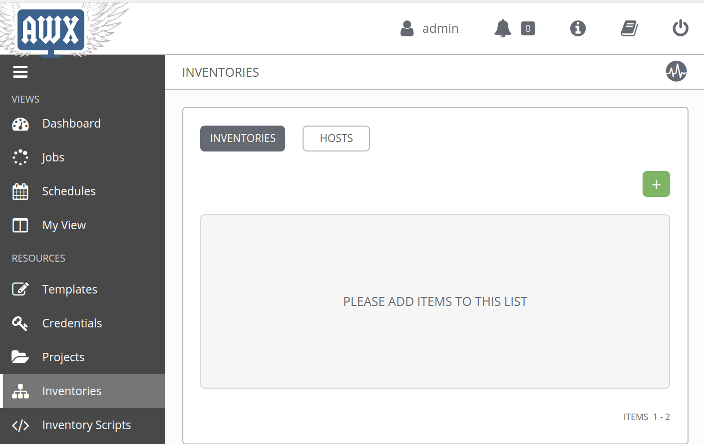

# install_python_modules.yml

This role is made to install the `ibmsecurity_ci/ibmsecurity` into your python library folder and merge with the existing `ibmsecurity` library. This to extend that library with the CIC module.

# AWX
This role can be used to install the modules.

1. Login Ansible Tower/AWX with administrator privileges.

## Create Inventory
1. Navigate to inventories and click on “+” to create new.

  

2. Update the name field with desired values: `AWX - localhost`

  

3. Here is the newly created inventory.

  

4. Navigate to Host Tab and click on “+” to create new.

  

5. Update the host name field with the value: `localhost`

  

6. Here is the newly created inventory with a host.

  

## Create Project
1. Navigate to Projects and click on “+” to create new.

  

2. Update the name, SCM Type, SCM URL fields with desired values, and enable `clean & delete on update`: 
- name: `AWX - localhost`
- SCM Type: `GIT`
- SCM URL: `https://github.com/CoolZeroNL/ibmsecurity_ci.git`

  

3. Here is the newly created Project, and see that the bullet in front is `green`.

  

## Create Template
1. Navigate to Templates and click on “+” to create new.

  

2. Update the name, Job Type, Inventory, Project, Playbook fields with desired values:
- Name: `Install Python Modules`
- Job Type: `Run`
- Inventory: `AWX - localhost`
- Project: `ibmsecurity_ci (Master)`
- Playbook: `ci-ansible-playbook-sample/install_python_modules.yml`

  

3. Here is the newly created Template.

  

4. Use the Rocket to launch a Job with this Template. ( This will install the modules on the local machine. )

